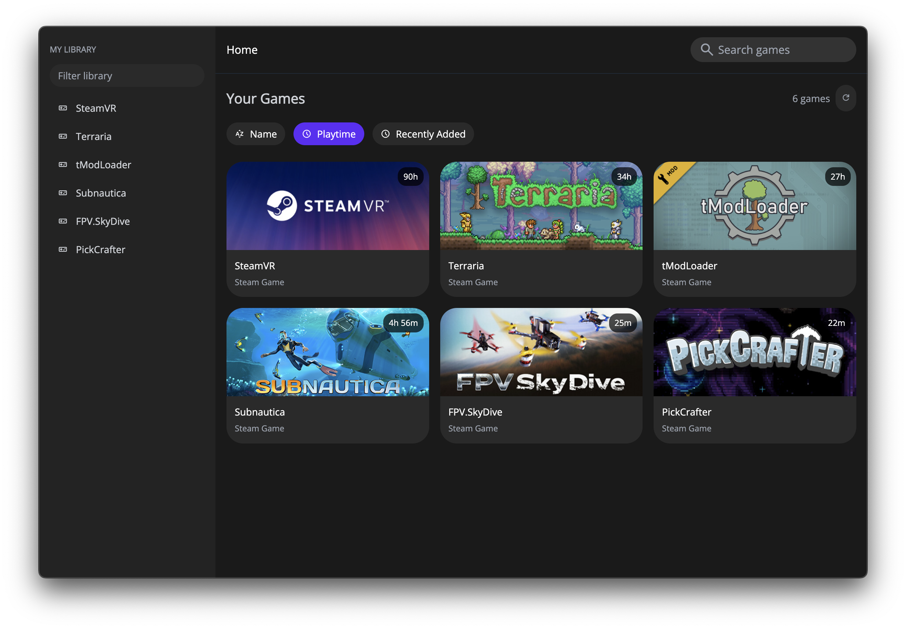

<h1 align="center">Portal Launcher - decided by a coin-flip</h1>

  <strong>Portal Launcher is an open-source gaming launcher created to simplify modern game launchers.</strong>

## Features

- Add games that you own to your library automatically
- Sort your library easily

## Contributors

